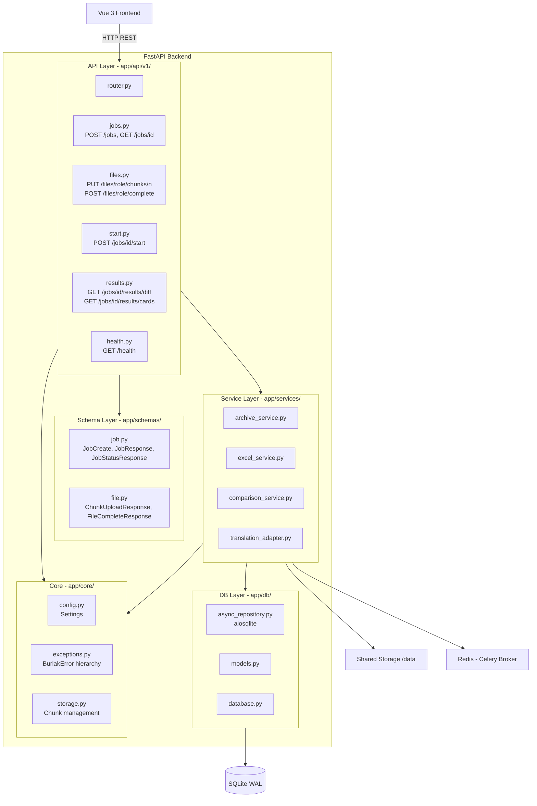
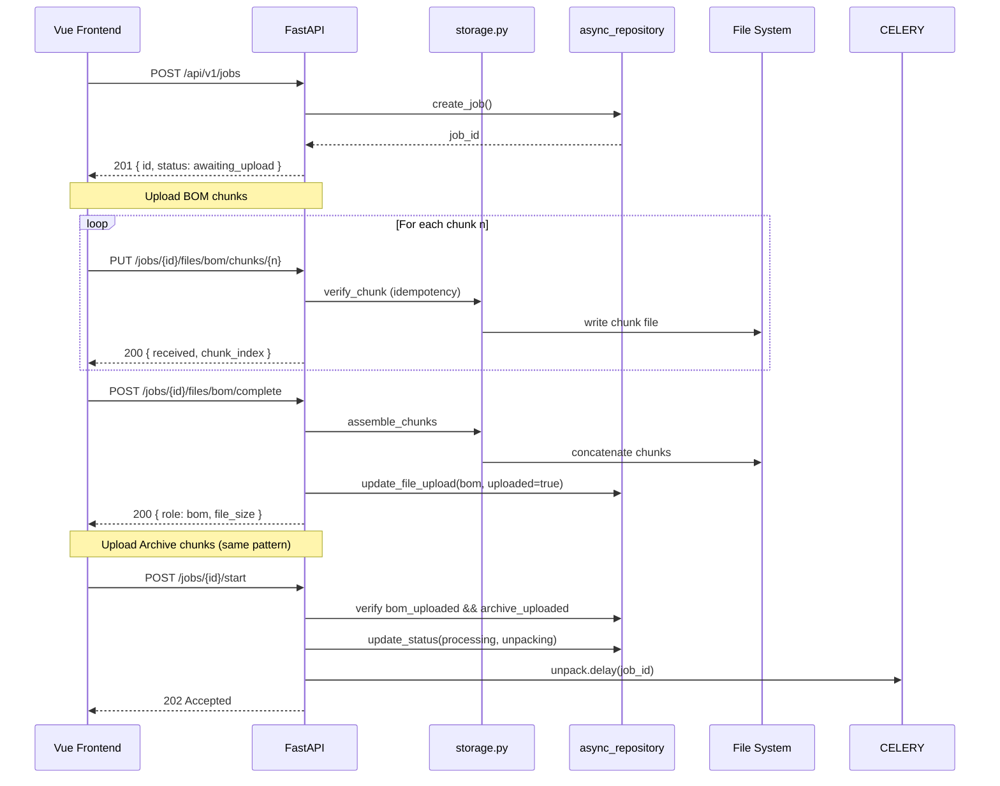
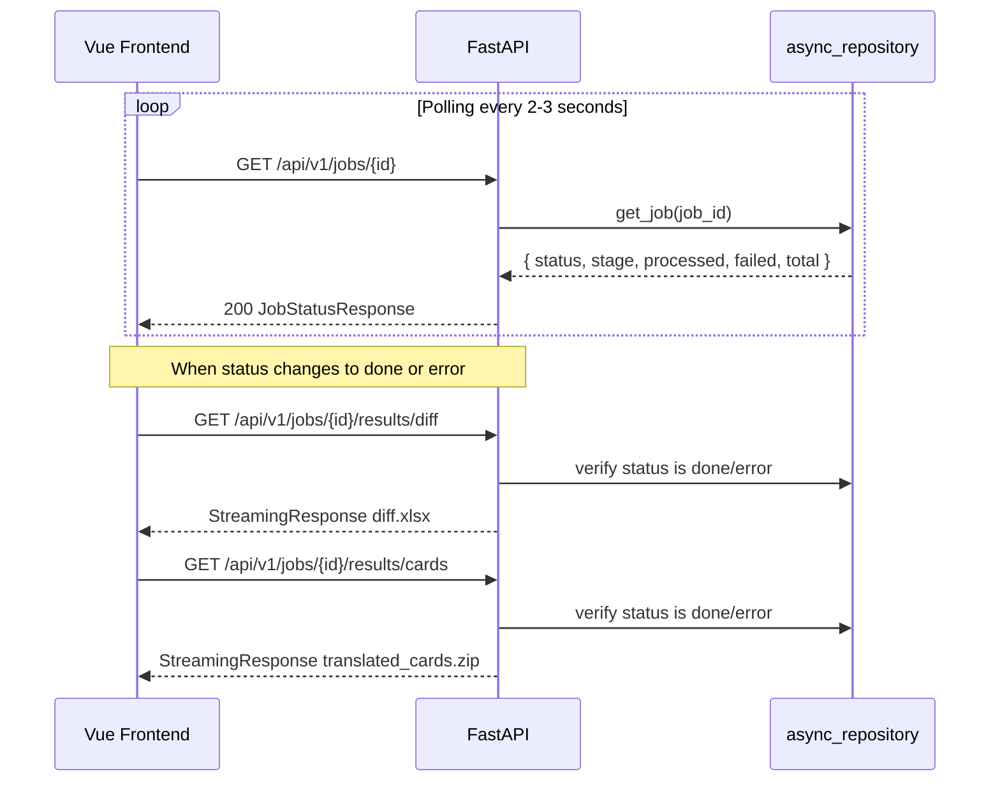

# FastAPI Backend Architecture

> **Назначение:** Данный документ описывает архитектуру FastAPI-бэкенда: структуру пакетов, слои приложения, диаграммы компонентов и потоков данных.
>
> **Связанные документы:**
> - [`container_architecture.md`](container_architecture.md) — C4 Level 2 (контейнеры)
> - [`celery_worker_arc.md`](celery_worker_arc.md) — C4 Level 3 (воркеры)
> - [`technical_specification.md`](technical_specification.md) — детальная спецификация реализации
> - [`api_reference.md`](api_reference.md) — полная спецификация эндпоинтов
> - [`error_handling.md`](error_handling.md) — коды ошибок и обработка
> - [`data_flow.md`](data_flow.md) — сквозной поток данных

---

## 1. Общая архитектура



---

## 2. Структура пакетов

```
burlak-backend/app/
├── api/
│   └── v1/
│       ├── __init__.py
│       ├── router.py            # Агрегатор всех v1 роутеров
│       ├── jobs.py              # POST /jobs, GET /jobs/{id}, POST /jobs/{id}/start
│       ├── files.py             # Чанковая загрузка файлов
│       ├── results.py           # Скачивание результатов
│       └── health.py            # GET /health
│
├── core/
│   ├── __init__.py
│   ├── config.py                # Settings (pydantic-settings)
│   ├── exceptions.py            # Иерархия исключений
│   └── storage.py               # Управление файлами и чанками
│
├── schemas/
│   ├── __init__.py
│   ├── job.py                   # Pydantic модели для jobs API
│   └── file.py                  # Pydantic модели для file upload
│
├── services/
│   ├── __init__.py
│   ├── archive_service.py       # Потоковая работа с ZIP
│   ├── excel_service.py         # XLSX парсинг/запись
│   ├── comparison_service.py    # Сверка с BOM
│   └── translation_adapter.py   # HTTP-клиент для ML
│
├── db/
│   ├── __init__.py
│   ├── database.py              # SQLAlchemy engine
│   ├── models.py                # Jobs, Cards ORM модели
│   ├── async_repository.py      # Асинхронный репозиторий (aiosqlite)
│   └── sync_repository.py       # Синхронный репозиторий (sqlite3)
│
├── worker/
│   ├── __init__.py
│   ├── celery_app.py            # Celery application
│   └── tasks/
│       ├── __init__.py
│       ├── unpack.py            # Распаковка архива
│       ├── analyze_mapping.py   # Определение структуры через ML
│       ├── process_card.py      # Обработка карты
│       ├── aggregate.py         # Финальная сверка
│       └── package.py           # Упаковка результатов
│
└── main.py                      # FastAPI приложение
```

---

## 3. Слои приложения

### 3.1 Core Layer (`app/core/`)

Центральный слой, от которого зависят все остальные.

| Компонент | Назначение |
|---|---|
| [`config.py`](../app/core/config.py) | `Settings` — загрузка конфигурации из `.env` через `pydantic-settings` |
| [`exceptions.py`](../app/core/exceptions.py) | Иерархия кастомных исключений с HTTP-статусами и кодами |
| [`storage.py`](../app/core/storage.py) | Управление файлами: чанки, сборка, пути |

### 3.2 Schema Layer (`app/schemas/`)

Pydantic-модели для валидации запросов и сериализации ответов.

| Компонент | Назначение |
|---|---|
| [`job.py`](../app/schemas/job.py) | `JobCreateResponse`, `JobStatusResponse`, `ErrorResponse` |
| [`file.py`](../app/schemas/file.py) | `ChunkUploadResponse`, `FileCompleteResponse` |

### 3.3 API Layer (`app/api/v1/`)

HTTP-роутеры. Только валидация и вызов сервисов — никакой бизнес-логики.

| Роутер | Эндпоинты |
|---|---|
| [`jobs.py`](../app/api/v1/jobs.py) | `POST /api/v1/jobs`, `GET /api/v1/jobs/{id}`, `POST /api/v1/jobs/{id}/start` |
| [`files.py`](../app/api/v1/files.py) | `PUT /api/v1/jobs/{id}/files/{role}/chunks/{n}`, `POST /api/v1/jobs/{id}/files/{role}/complete` |
| [`results.py`](../app/api/v1/results.py) | `GET /api/v1/jobs/{id}/results/diff`, `GET /api/v1/jobs/{id}/results/cards` |
| [`health.py`](../app/api/v1/health.py) | `GET /api/v1/health` |

### 3.4 Service Layer (`app/services/`)

Бизнес-логика, вызываемая из API-роутеров и Celery-задач.

| Сервис | Назначение |
|---|---|
| [`archive_service.py`](../app/services/archive_service.py) | Потоковое чтение ZIP, упаковка результатов |
| [`excel_service.py`](../app/services/excel_service.py) | Парсинг XLSX, style-preserving запись |
| [`comparison_service.py`](../app/services/comparison_service.py) | Сверка материалов с BOM, генерация diff |
| [`translation_adapter.py`](../app/services/translation_adapter.py) | HTTP-клиент для ML-сервиса |

### 3.5 DB Layer (`app/db/`)

Два репозитория над одной SQLite БД в WAL-режиме.

| Компонент | Контекст | Драйвер |
|---|---|---|
| [`async_repository.py`](../app/db/async_repository.py) | FastAPI (async) | `aiosqlite` |
| [`sync_repository.py`](../app/db/sync_repository.py) | Celery workers (sync) | `sqlite3` stdlib |

---

## 4. Диаграмма последовательности: загрузка файлов



---

## 5. Диаграмма последовательности: опрос статуса и скачивание



---

## 6. Интеграция с существующим кодом

### Уже реализовано (изменения не требуются)

| Файл | Статус |
|---|---|
| [`app/core/config.py`](../app/core/config.py) | Готов — `Settings` со всеми полями |
| [`app/db/models.py`](../app/db/models.py) | Готов — `Jobs` и `Cards` ORM-модели |
| [`app/db/database.py`](../app/db/database.py) | Готов — SQLAlchemy engine + `get_db()` |
| [`app/db/async_repository.py`](../app/db/async_repository.py) | Готов — все async CRUD операции |
| [`app/db/sync_repository.py`](../app/db/sync_repository.py) | Готов — `increment_progress` с `BEGIN IMMEDIATE` |

### Требуется создать

| Приоритет | Файл | Зависит от |
|---|---|---|
| P0 | `app/core/exceptions.py` | — |
| P0 | `app/core/storage.py` | `config.py` |
| P0 | `app/schemas/job.py` | — |
| P0 | `app/schemas/file.py` | — |
| P0 | `app/api/v1/health.py` | — |
| P0 | `app/api/v1/jobs.py` | `async_repository`, `schemas/job`, `exceptions` |
| P0 | `app/api/v1/files.py` | `async_repository`, `storage`, `schemas/file` |
| P0 | `app/api/v1/router.py` | Все роутеры |
| P0 | `app/main.py` (обновление) | Роутеры, exception handlers, lifespan |
| P1 | `app/api/v1/results.py` | `async_repository`, `exceptions` |
| P1 | `app/worker/celery_app.py` | `config.py` |
| P2 | `app/services/*.py` | — |
| P2 | `app/worker/tasks/*.py` | Services + repositories |

---

## 7. Ключевые архитектурные решения

| Решение | Обоснование |
|---|---|
| **StreamingResponse для скачивания** | Файлы до 1.3 ГБ не должны загружаться в память API-процесса |
| **Чанковая загрузка (20 MB)** | Стабильная передача больших файлов через HTTP с возможностью resume |
| **Идемпотентность чанков** | Безопасные повторные отправки при сетевых таймаутах |
| **Два репозитория БД** | FastAPI (async) + Celery (sync) — разные драйверы для разных контекстов |
| **BEGIN IMMEDIATE в sync_repository** | Предотвращение deadlock'ов при конкурентной записи в WAL-режиме |
| **Атомарный счётчик вместо Celery Chord** | Надёжная координация 1000+ воркеров без тяжёлых аккордов |