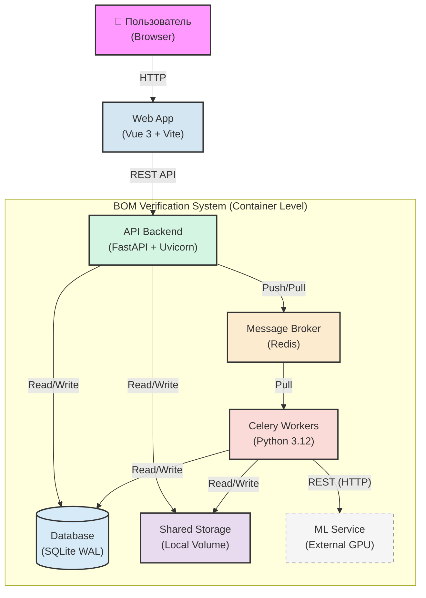

# Архитектура контейнеров (C4 Level 2)

> **Назначение:** Данный документ описывает систему на уровне контейнеров (C4 Level 2) — высокоуровневую архитектуру, компоненты и сквозной поток данных. Не содержит деталей реализации, контрактов API или внутренней структуры воркеров.
>
> **Связанные документы:**
> - [`technical_specification.md`](technical_specification.md) — детальная спецификация реализации (стек, State Machine, API, файловая структура)
> - [`celery_worker_arc.md`](celery_worker_arc.md) — внутренняя архитектура Celery Worker (C4 Level 3)
> - [`fastapi_api_architecture.md`](fastapi_api_architecture.md) — архитектура FastAPI бэкенда (слои, компоненты, диаграммы)
> - [`api_reference.md`](api_reference.md) — полная спецификация эндпоинтов с примерами запросов/ответов
> - [`error_handling.md`](error_handling.md) — коды ошибок, иерархия исключений, примеры
> - [`data_flow.md`](data_flow.md) — сквозной поток данных через все компоненты системы

---

## 1. Общее описание системы

Система представляет собой **асинхронное сервис-ориентированное приложение (Event-Driven Mini-Service)**, спроектированное для высоконагруженной потоковой обработки тяжелых инженерных данных в изолированном контуре.

**Характеристики обрабатываемых данных:**

| Тип данных | Типичный вес | Описание |
|---|---|---|
| BOM-таблица | до 5.5 МБ | Эталонная спецификация материалов (Bill of Materials) |
| Архив операционных карт | до 1.3 ГБ | ZIP-архив, содержащий ~1000 Excel-файлов технологических карт |

**Окружение:** Закрытый изолированный контур. Reverse Proxy (Nginx) не используется — FastAPI выступает единой точкой входа для API, а фронтенд (Vue 3) раздается статически или работает в режиме разработки через Vite dev server.

---

## 2. Диаграмма контейнеров (Mermaid)



---

## 3. Компоненты системы (Контейнеры)

### 3.1. Web App (Vue 3 + Vite)

| Свойство | Значение |
|---|---|
| **Роль** | Клиентский интерфейс пользователя |
| **Технология** | Vue 3 + Vite + TypeScript |
| **Исполнение** | Браузер пользователя |

**Обязанности:**
- Нарезка тяжелых архивов на чанки (куски по 20 МБ) для стабильной загрузки через HTTP
- Поштучная отправка чанков с подтверждением (использует `useChunkedUpload.ts`)
- Опрос бэкенда по REST API для обновления прогресс-бара (polling)
- Интерфейс для скачивания результатов (diff-отчет + переведенные карты)
- Валидация файлов перед отправкой (расширение, размер)

**Ключевые модули фронтенда:**
| Модуль | Назначение |
|---|---|
| `FileUploader.vue` | Главный компонент загрузки файлов |
| `useChunkedUpload.ts` | Логика чанковой загрузки (composable) |
| `uploadStore.ts` | Управление состоянием загрузки (Pinia store) |

---

### 3.2. API Backend (FastAPI + Uvicorn)

| Свойство | Значение |
|---|---|
| **Роль** | Единая точка входа для API, асинхронный HTTP-сервер |
| **Технология** | FastAPI + Uvicorn (Python 3.12) |
| **Протокол** | REST (JSON) |
| **Порт** | 8000 (по умолчанию) |

**Обязанности:**
- Прием HTTP-запросов от фронтенда (загрузка файлов, запуск задач, опрос статуса, скачивание результатов)
- Прием чанков файлов и склейка их напрямую на диск (Shared Storage)
- Регистрация задач в базе данных (SQLite)
- Отправка сигналов в очередь (Redis) для запуска фоновой обработки
- Моментальный возврат ответа клиенту, не дожидаясь окончания обработки (асинхронный паттерн)
- Потоковая отдача готовых файлов клиенту через `StreamingResponse`
- Endpoint `/health` для проверки состояния системы

**Почему без Nginx:** Система работает в закрытом изолированном контуре без высокой нагрузки. FastAPI + Uvicorn самостоятельно обрабатывает входящие запросы, включая загрузку тяжелых файлов. Reverse Proxy не требуется.

---

### 3.3. Message Broker (Redis)

| Свойство | Значение |
|---|---|
| **Роль** | Брокер сообщений / очередь задач |
| **Технология** | Redis (in-memory) |
| **Модель** | Pull (воркеры сами забирают задачи) |

**Обязанности:**
- Хранение очереди подзадач (Celery task queue) для координации воркеров
- Распределение нагрузки между воркерами по Pull-модели
- Хранение результатов выполнения задач (Celery result backend)
- Быстрая передача триггеров между FastAPI и Celery Workers

---

### 3.4. Celery Workers (Python 3.12)

| Свойство | Значение |
|---|---|
| **Роль** | Изолированный пул вычислительных воркеров |
| **Технология** | Celery + Python 3.12 |
| **Модель** | Параллельные потоки (multiprocessing / gevent) |

**Обязанности:**
- Параллельное выполнение тяжелых CPU-bound операций:
  - Стриминговый парсинг Excel без загрузки всего архива в ОЗУ
  - Очистка и нормализация страниц
- Выступление в роли HTTP-клиентов для внешней ML-машины (GPU)
- Атомарное обновление прогресса в SQLite (инкремент счетчика)
- Запуск финальной агрегации при завершении всех подзадач

**Внутренняя архитектура детально описана в [`celery_worker_arc.md`](celery_worker_arc.md).**

---

### 3.5. Database (SQLite WAL)

| Свойство | Значение |
|---|---|
| **Роль** | Легковесная реляционная БД |
| **Технология** | SQLite (режим WAL) |
| **Формат** | Файл на диске (`./dev.db` по умолчанию) |

**Обязанности:**
- Хранение истории задач (таблица `jobs`)
- Хранение записей об отдельных картах (таблица `cards`)
- Хранение логов ошибок
- Точный счетчик прогресса (атомарный инкремент)

**Режим WAL (Write-Ahead Logging)** позволяет воркерам параллельно записывать статус, а бэкенду — читать его для фронтенда без блокировок (конкурентное чтение-запись).

---

### 3.6. Shared Storage (Local Volume)

| Свойство | Значение |
|---|---|
| **Роль** | Общее файловое хранилище |
| **Технология** | Docker Volume (локальный диск) |
| **Путь по умолчанию** | `/data` |
| **Доступ** | FastAPI + Celery Workers (read/write) |

**Обязанности:**
- Хранение исходных тяжелых файлов (BOM.xlsx, ZIP-архивы с картами)
- Хранение промежуточных отчетов (JSON-файлы материалов по каждой карте)
- Хранение финальных результатов (diff.xlsx, translated_cards.zip)
- Снабжен Cron-скриптом автоматической очистки данных старше 48 часов

---

### 3.7. ML Service (External)

| Свойство | Значение |
|---|---|
| **Роль** | Внешний сервис анализа структуры и перевода |
| **Технология** | GPU-ускоренная нейросеть |
| **Протокол** | REST (HTTP/JSON) |
| **Адрес по умолчанию** | `http://ml-service:8000` |

**Обязанности:**
- **Анализ структуры:** Принимает JSON-слепок структуры Excel (первые 20 строк каждого листа) и возвращает схему: координаты колонок, строки начала данных, ключи сопоставления (mapping). Зона ответственности AI минимальна — не извлекает данные, только описывает координаты.
- **Перевод:** Принимает пул уникальных строк и возвращает переведенные соответствия.

**Детальное описание взаимодействия с ML-сервисом на уровне воркера см. в [`celery_worker_arc.md`](celery_worker_arc.md) (раздел 2.3 Analyze Mapping Task).**

---

## 4. Сквозной жизненный цикл задачи (Data Flow)

### 4.1. Загрузка

```
Браузер (Vue) → FastAPI → Shared Storage
```

1. Фронтенд (Vue 3) нарезает архив 1.3 ГБ на чанки по 20 МБ через `useChunkedUpload.ts`
2. Чанки передаются напрямую в FastAPI (без промежуточного proxy)
3. FastAPI склеивает чанки и сохраняет файл в Shared Storage
4. Бэкенд создает запись в SQLite (статус: `awaiting_upload`)
5. После подтверждения загрузки всех файлов фронтенд вызывает `/start`
6. Бэкенд переводит статус в `processing` и отправляет триггер в Redis
7. Пользователь сразу видит прогресс-бар (фронтенд опрашивает `GET /jobs/{id}`)

### 4.2. Разделение задач

```
Shared Storage → Celery Worker (Unpack Task) → Redis
```

1. Первый свободный Celery Worker открывает оглавление ZIP-архива **без распаковки** (streaming через `zipfile.infolist()`)
2. Считывает список из ~1000 карт
3. Создает записи в таблице `cards` (SQLite)
4. Генерирует в Redis 1000 мелких атомарных подзадач (`process_card`)

### 4.3. Параллельная обработка и локальный сбор

```
Redis → Celery Workers (N экземпляров) → Shared Storage → SQLite
```

1. Все доступные воркеры параллельно разбирают задачи из Redis
2. Каждый воркер:
   - Стримит из архива свой Excel-файл (чтение по смещению через `zipfile.open()`, без распаковки на диск)
   - Извлекает данные по объемам материалов (гвозди, винты и т.д.)
   - Сохраняет промежуточный JSON-отчет по этой карте в Shared Storage
   - Отправляет текст в ML-сервис (нейросеть)
   - Получает перевод
   - Пересобирает карту в оригинальном стиле (style-preserving)
   - Инкрементирует счетчик в SQLite (атомарно, через `BEGIN IMMEDIATE`)

### 4.4. Агрегированный матчинг (Сверка)

```
SQLite (счетчик: processed + failed == total) → Celery Worker (Aggregate Task) → Shared Storage
```

1. Когда счетчик в SQLite достигает `processed + failed == total`, последний завершившийся воркер **самостоятельно** отправляет задачу агрегации (без Celery Chord)
2. Воркер-агрегатор:
   - Загружает BOM.xlsx
   - Суммирует данные из всех JSON-файлов материальных затрат (отношение «один ко многим»)
   - Формирует математически точную итоговую таблицу `diff.xlsx` на исходном языке
   - Исключает ошибки машинного перевода (использует оригинальные наименования для сверки)

### 4.5. Выдача результата

```
Shared Storage → FastAPI → Браузер (Vue)
```

1. Агрегатор упаковывает переведенные карты в итоговый `translated_cards.zip`
2. Меняет статус в SQLite на `done` (или `error`, если `failed > 0`)
3. Фронтенд (опрос бэкенда через `GET /jobs/{id}`) получает статус и показывает кнопки скачивания
4. Пользователь инициирует GET-запрос на `/jobs/{id}/results/diff` или `/jobs/{id}/results/cards`
5. FastAPI потоком (`StreamingResponse`) отдает готовые файлы с диска клиенту

---

## 5. Принципы архитектуры

| Принцип | Описание |
|---|---|
| **Event-Driven** | Все компоненты общаются через асинхронные сообщения (Redis), а не синхронные вызовы |
| **Stateless API** | FastAPI не хранит состояние задач — вся информация в SQLite и Redis |
| **Pull-модель** | Воркеры сами забирают задачи из очереди, а не получают их принудительно |
| **Streaming I/O** | Тяжелые файлы никогда не читаются в ОЗУ целиком — только потоково |
| **Fault Isolation** | Сбой одного воркера не влияет на остальные; битые карты не блокируют общий прогресс |
| **Idempotency** | Повторная отправка чанка или повторный запуск задачи безопасны |
| **No Orchestrator** | Отказ от Celery Chord — триггер агрегации через атомарный счетчик в SQLite |