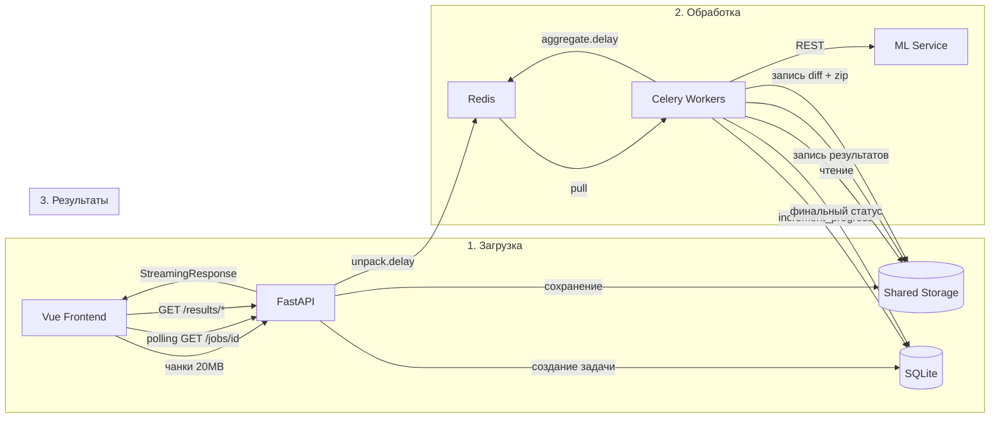

# Data Flow

> **Назначение:** Документ описывает сквозной поток данных через все компоненты системы — от загрузки файлов до выдачи результатов.
>
> **Связанные документы:**
> - [`container_architecture.md`](container_architecture.md) — C4 Level 2 (контейнеры)
> - [`celery_worker_arc.md`](celery_worker_arc.md) — C4 Level 3 (воркеры)
> - [`fastapi_api_architecture.md`](fastapi_api_architecture.md) — архитектура API
> - [`api_reference.md`](api_reference.md) — спецификация эндпоинтов

---

## 1. Общая схема потока



---

## 2. Этап 1: Загрузка файлов

### 2.1. Создание задачи

```
Frontend                    FastAPI                     SQLite
   │                          │                          │
   │  POST /api/v1/jobs       │                          │
   │─────────────────────────>│                          │
   │                          │  INSERT INTO jobs        │
   │                          │─────────────────────────>│
   │                          │  status: awaiting_upload │
   │                          │<─────────────────────────│
   │  201 { id, status }      │                          │
   │<─────────────────────────│                          │
```

### 2.2. Чанковая загрузка BOM

```
Frontend                    FastAPI                 Shared Storage
   │                          │                          │
   │  PUT /files/bom/chunks/0 │                          │
   │  X-Total-Chunks: 5       │                          │
   │  [20 MB binary]          │                          │
   │─────────────────────────>│                          │
   │                          │  verify_chunk (idemp.)   │
   │                          │  write {job}/chunks/     │
   │                          │─────────────────────────>│
   │  200 { received, idx }   │                          │
   │<─────────────────────────│                          │
   │                          │                          │
   │  ... (повтор для чанков 1-4) ...                    │
   │                          │                          │
   │  POST /files/bom/complete│                          │
   │─────────────────────────>│                          │
   │                          │  assemble_chunks         │
   │                          │  concatenate → bom.xlsx  │
   │                          │─────────────────────────>│
   │                          │                          │
   │  200 { role, size }      │                          │
   │<─────────────────────────│                          │
```

### 2.3. Загрузка архива

Аналогично BOM, но с `role: archive`. После завершения:

```
Frontend                    FastAPI                     SQLite
   │                          │                          │
   │  POST /jobs/{id}/start   │                          │
   │─────────────────────────>│                          │
   │                          │  verify bom_uploaded     │
   │                          │  verify archive_uploaded │
   │                          │                          │
   │                          │  UPDATE jobs             │
   │                          │  SET status=processing   │
   │                          │  SET stage=unpacking     │
   │                          │─────────────────────────>│
   │                          │                          │
   │                          │  unpack.delay(job_id)    │
   │                          │─────────────────────────>│
   │                          │              (Redis)     │
   │  202 Accepted            │                          │
   │<─────────────────────────│                          │
```

---

## 3. Этап 2: Обработка

### 3.1. Распаковка архива (Unpack Task)

```
Celery Worker               Shared Storage              SQLite
   │                              │                        │
   │  unpack(job_id)              │                        │
   │                              │                        │
   │  zipfile.infolist()          │                        │
   │─────────────────────────────>│                        │
   │  список ~1000 карт           │                        │
   │<─────────────────────────────│                        │
   │                              │                        │
   │  INSERT INTO cards × 1000    │                        │
   │──────────────────────────────────────────────────────>│
   │                              │                        │
   │  UPDATE jobs SET total=1000  │                        │
   │──────────────────────────────────────────────────────>│
   │                              │                        │
   │  analyze_mapping.delay()     │                        │
   │─────────────────────────────>│                        │
   │                   (Redis)    │                        │
```

### 3.2. Анализ структуры (Analyze Mapping Task)

```
Celery Worker           Shared Storage          ML Service              SQLite
   │                          │                      │                    │
   │  analyze_mapping(id)     │                      │                    │
   │                          │                      │                    │
   │  read BOM.xlsx           │                      │                    │
   │─────────────────────────>│                      │                    │
   │  read sample cards       │                      │                    │
   │─────────────────────────>│                      │                    │
   │                          │                      │                    │
   │  extract JSON snapshot   │                      │                    │
   │  (первые 20 строк)       │                      │                    │
   │                          │                      │                    │
   │  POST /analyze           │                      │                    │
   │────────────────────────────────────────────────>│                    │
   │                          │                      │                    │
   │  mapping_config          │                      │                    │
   │<────────────────────────────────────────────────│                    │
   │                          │                      │                    │
   │  UPDATE jobs             │                      │                    │
   │  SET mapping_config=...  │                      │                    │
   │  SET stage=processing    │                      │                    │
   │──────────────────────────────────────────────────────────────────────>│
   │                          │                      │                    │
   │  process_card.delay() × 1000                    │                    │
   │─────────────────────────>│                      │                    │
   │              (Redis)     │                      │                    │
```

### 3.3. Обработка карт (Process Card Task)

Выполняется параллельно на N воркерах.

```
Celery Worker N           Shared Storage          ML Service              SQLite
   │                              │                      │                    │
   │  process_card(id, path)      │                      │                    │
   │                              │                      │                    │
   │  zipfile.open(card_path)     │                      │                    │
   │─────────────────────────────>│                      │                    │
   │  stream XLSX bytes           │                      │                    │
   │<─────────────────────────────│                      │                    │
   │                              │                      │                    │
   │  parse card using            │                      │                    │
   │  mapping_config              │                      │                    │
   │                              │                      │                    │
   │  extract unique strings      │                      │                    │
   │                              │                      │                    │
   │  POST /translate             │                      │                    │
   │────────────────────────────────────────────────────>│                    │
   │  translated strings          │                      │                    │
   │<────────────────────────────────────────────────────│                    │
   │                              │                      │                    │
   │  write card_XX_translated    │                      │                    │
   │─────────────────────────────>│                      │                    │
   │                              │                      │                    │
   │  write card_XX_materials     │                      │                    │
   │─────────────────────────────>│                      │                    │
   │                              │                      │                    │
   │  BEGIN IMMEDIATE             │                      │                    │
   │  UPDATE cards SET status     │                      │                    │
   │  UPDATE jobs SET processed++ │                      │                    │
   │─────────────────────────────────────────────────────────────────────────>│
   │                              │                      │                    │
   │  if processed+failed==total: │                      │                    │
   │    aggregate.delay(id)       │                      │                    │
   │─────────────────────────────>│                      │                    │
   │                   (Redis)    │                      │                    │
```

### 3.4. Атомарный инкремент прогресса

Ключевой механизм координации. Вместо Celery Chord используется атомарный счётчик в SQLite.

```python
# sync_repository.py
def increment_progress(job_id, card_path, *, success, error_message=None):
    conn.execute("BEGIN IMMEDIATE")
    
    # 1. Проверка текущего статуса карты (идемпотентность)
    card = conn.execute("SELECT status FROM cards WHERE ...")
    
    # 2. Расчёт дельт (processed_delta, failed_delta)
    #    pending→success:  +1 processed
    #    pending→failed:   +1 failed
    #    success→failed:   -1 processed, +1 failed
    #    failed→success:   +1 processed, -1 failed
    
    # 3. UPDATE cards SET status
    # 4. UPDATE jobs SET processed+=delta, failed+=delta
    
    # 5. Проверка завершения
    is_complete = (processed + failed == total)
    
    conn.commit()
    return ProgressResult(is_complete, processed, failed, total)
```

---

## 4. Этап 3: Агрегация и результаты

### 4.1. Финальная сверка (Aggregate Task)

```
Celery Worker           Shared Storage              SQLite
   │                              │                    │
   │  aggregate(job_id)           │                    │
   │                              │                    │
   │  read BOM.xlsx               │                    │
   │─────────────────────────────>│                    │
   │                              │                    │
   │  read all card_*_materials   │                    │
   │─────────────────────────────>│                    │
   │                              │                    │
   │  compare BOM vs materials    │                    │
   │  (join/merge)                │                    │
   │                              │                    │
   │  generate diff.xlsx          │                    │
   │─────────────────────────────>│                    │
   │                              │                    │
   │  package translated_cards.zip│                    │
   │─────────────────────────────>│                    │
   │                              │                    │
   │  if failed > 0:              │                    │
   │    UPDATE status = error     │                    │
   │  else:                       │                    │
   │    UPDATE status = done      │                    │
   │──────────────────────────────────────────────────>│
```

### 4.2. Поллинг статуса

```
Frontend                    FastAPI                     SQLite
   │                          │                          │
   │  GET /jobs/{id}          │                          │
   │  (каждые 2-3 сек)        │                          │
   │─────────────────────────>│                          │
   │                          │  SELECT * FROM jobs      │
   │                          │─────────────────────────>│
   │                          │<─────────────────────────│
   │  200 { status, stage,    │                          │
   │        processed, total }│                          │
   │<─────────────────────────│                          │
```

### 4.3. Скачивание результатов

```
Frontend                    FastAPI                 Shared Storage
   │                          │                          │
   │  GET /results/diff       │                          │
   │─────────────────────────>│                          │
   │                          │  verify status done/error│
   │                          │                          │
   │                          │  StreamingResponse       │
   │                          │  open(diff.xlsx)         │
   │                          │─────────────────────────>│
   │  200 OK                  │                          │
   │  Content-Type: xlsx      │                          │
   │  <streaming binary>      │                          │
   │<─────────────────────────│                          │
```

---

## 5. Сводная таблица: что куда пишется

| Данные | Откуда | Куда | Формат |
|---|---|---|---|
| Чанки файлов | Frontend → FastAPI | `{storage}/{job}/chunks/{role}_{n}.part` | Бинарный |
| Собранный BOM | FastAPI | `{storage}/{job}/bom.xlsx` | XLSX |
| Собранный архив | FastAPI | `{storage}/{job}/archive.zip` | ZIP |
| Задача (job) | FastAPI | SQLite `jobs` | Row |
| Карты (cards) | Unpack Task | SQLite `cards` | Row |
| mapping_config | Analyze Mapping Task | SQLite `jobs.mapping_config` | JSON |
| Материалы карты | Process Card Task | `{storage}/{job}/cards/card_{n}_materials.json` | JSON |
| Переведённая карта | Process Card Task | `{storage}/{job}/cards/card_{n}_translated.xlsx` | XLSX |
| diff.xlsx | Aggregate Task | `{storage}/{job}/diff.xlsx` | XLSX |
| translated_cards.zip | Package Task | `{storage}/{job}/translated_cards.zip` | ZIP |