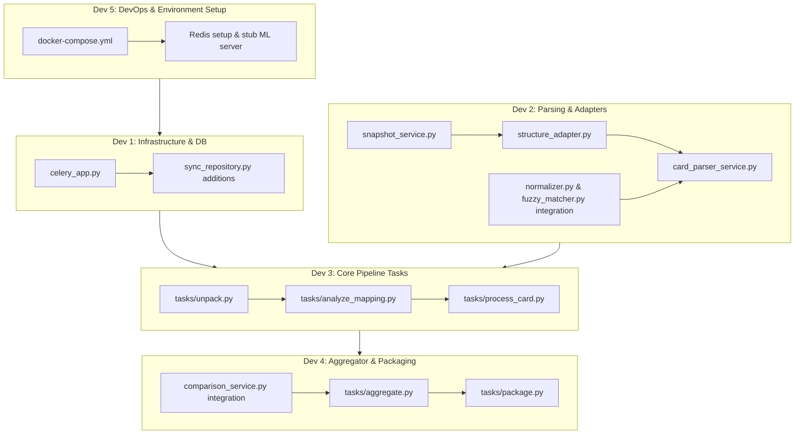

# Plan: Celery Workers & ML Integration Implementation

This document outlines the architecture, tasks division, and verification steps for implementing the Celery tasks pipeline and ML structure service integration for the BOM Verification System.

---

## User Review Required

> [!IMPORTANT]
> To allow parallel development and avoid git merge conflicts, we propose splitting the codebase into five logical, independent task packages.
> 
> **Architecture note:** In Celery tasks (which run in a synchronous worker context), we MUST use standard synchronous `sqlite3` calls to update the database, using the low-level WAL-safe transactions in `db/sync_repository.py`. We must never call async `aiosqlite` methods.

---

## Technical Decisions & Clarifications

1. **Single ML Service:** The system will use a single ML service URL (`ML_SERVICE_URL`) for both structural analysis and machine translation.
2. **Translation Service API Contract:** Since no predefined translation API is specified, we will implement a simple batch translation contract:
   ```json
   POST /api/v1/translate
   Request:
   {
     "texts": ["螺栓M6×20", "螺母M8"],
     "source_lang": "zh",
     "target_lang": "ru"
   }
   Response:
   {
     "translations": ["Болт M6x20", "Гайка M8"]
   }
   ```
3. **Storage of Intermediate Translated Cards (Recommendation):**
   * Workers will save translated cards to a temporary directory: `/data/{job_id}/translated_cards/` (e.g. `card_1_translated.xlsx`, `card_2_translated.xlsx`).
   * When `package` task runs, it zips this folder to `/data/{job_id}/translated_cards.zip`.
   * **Crucial:** Immediately after successful zipping, the `package` task will recursively delete the temporary `/data/{job_id}/translated_cards/` folder. This prevents redundant uncompressed files from exhausting disk space.

---

## Proposed Changes

We divide the implementation into five independent workstreams for parallel execution by different developers.



---

### 1. Workstream A: Celery Infrastructure & DB Persistence (Developer 1)

This workstream sets up the Celery application and extends the synchronous repository to support the background pipeline updates.

#### [NEW] [celery_app.py](file:///burlak-backend/app/worker/celery_app.py)
* Define the Celery application bound to `settings.redis_url`.
* Configure automatic task discovery in `app.worker.tasks.*`.
* Configure retries with standard backoff (`max_retries=3`, `retry_backoff=True`, `retry_backoff_max=30`).

#### [MODIFY] [sync_repository.py](file:///burlak-backend/app/db/sync_repository.py)
* Implement low-level WAL-safe (using `BEGIN IMMEDIATE`) synchronous methods:
  * `update_mapping_config(job_id: int, mapping_config: dict) -> None`
  * `update_job_status(job_id: int, status: str, stage: str | None = None) -> None`
  * `get_mapping_config(job_id: int) -> dict`
  * `get_job_files(job_id: int) -> tuple[str, str]` (returns paths of BOM and ZIP archive)

---

### 2. Workstream B: Parsing & ML Adapters (Developer 2)

This workstream implements Excel snapshot extraction, ML API clients, and the dynamic sheet parser based on ML mapping configuration. It also integrates core normalizers from the initial prototype.

#### [INTEGRATE] [normalizer.py](file:///burlak-backend/app/services/normalizer.py) & [fuzzy_matcher.py](file:///burlak-backend/app/services/fuzzy_matcher.py)
* Copy and adapt these components from the initial `burlak_parser` prototype to clean up and unify catalog number normalization and safe matching logic.

#### [NEW] [snapshot_service.py](file:///burlak-backend/app/services/snapshot_service.py)
* Implement `SnapshotService.extract_snapshot_from_bytes(data: bytes, filename: str, max_rows: int = 50)`:
  * Reads XLSX from memory via `openpyxl.load_workbook(io.BytesIO(data), data_only=True)`.
  * Gathers first 40–50 rows of each sheet.
  * **Critical:** Caps columns scanned using `min(ws.max_column or 0, 50)` to prevent memory issues.
* Implement `group_by_format(file_paths: list[str]) -> dict[str, list[str]]` to group files by prefix patterns (e.g. `SQRT1L-17-AS-04001` and `SQRT1L-17-AS-04002` grouped as `card_format_A`).

#### [NEW] [structure_adapter.py](file:///burlak-backend/app/services/structure_adapter.py)
* Implement sync `StructureAdapter` using `httpx.Client` (since Celery worker processes run synchronously, avoid async event loop overhead).
* Call `/api/v1/analyze-structure` to retrieve `mapping_config` from `ml_service_url`.
* Call `/api/v1/translate` to batch-translate Chinese names.

#### [NEW] [card_parser_service.py](file:///burlak-backend/burlak-backend/app/services/card_parser_service.py)
* Classify files into `service`, `operational_card` or `unknown` using `file_classification_rules` regex and keyword lists.
* Locate and extract parts from operational sheets using column indices and `table_boundaries` config (supporting `end_markers` like signature lines, etc.).

---

### 3. Workstream C: Core Pipeline Tasks (Developer 3)

This workstream wires the FastAPI task entrypoints and implements the unpacking, structure analysis, and translation loops.

#### [MODIFY] [job_processing_service.py](file:///burlak-backend/app/services/job_processing_service.py)
* Wire `dispatch_processing` to trigger `unpack.delay(job_id)`.

#### [NEW] [tasks/unpack.py](file:///burlak-backend/app/worker/tasks/unpack.py)
* Open ZIP archive and read contents using `zipfile.ZipFile.infolist()`.
* Store list of files in `cards` table with status `pending`.
* Set total card count on `jobs`.
* Update stage to `analyzing_mapping` and trigger `analyze_mapping.delay(job_id)`.

#### [NEW] [tasks/analyze_mapping.py](file:///burlak-backend/app/worker/tasks/analyze_mapping.py)
* Extract representative XLSX snapshots for each format group.
* Call ML service `/api/v1/analyze-structure` to get `mapping_config`.
* Store configuration in the DB.
* Update job status to `processing / processing_cards`.
* Enqueue `process_card.delay(job_id, card_path)` for all operational cards.

#### [NEW] [tasks/process_card.py](file:///burlak-backend/app/worker/tasks/process_card.py)
* Open card stream using `zipfile.open(card_path)`.
* Classify and parse using `CardParserService`.
* Translate Chinese strings to Russian via translation client.
* Write results:
  * Extracted JSON parts/materials to shared storage.
  * Style-preserving translated XLSX (modifying only `.value` of translated cells) to temporary `/data/{job_id}/translated_cards/` folder.
* Atomically increment progress. If `processed + failed == total`, spawn `aggregate.delay()`.
* Wrap in `try/except` to catch all parsing issues and mark card `failed` in DB with error logs.

---

### 4. Workstream D: Aggregator & Packaging Tasks (Developer 4)

This workstream runs final comparative calculations, aggregates results, and bundles them into target ZIP archives. It integrates existing matching engines and reports generators.

#### [INTEGRATE] [comparison_service.py](file:///burlak-backend/app/services/comparison_service.py)
* Adapt the comparative matching rules and reporting spreadsheet layout logic from the initial prototype (`comparator.py` and `report_generator.py`) to build the new comparison service.

#### [NEW] [tasks/aggregate.py](file:///burlak-backend/app/worker/tasks/aggregate.py)
* Parse `BOM.xlsx`.
* Load all card materials JSONs from shared storage.
* Perform pandas merge/join to check for discrepancies (deficits, overages, incorrect naming).
* Write the structured differences into `/data/{job_id}/diff.xlsx` (including error reports from any failed cards).
* Transition job stage to `packaging` and call `package.delay(job_id)`.

#### [NEW] [tasks/package.py](file:///burlak-backend/app/worker/tasks/package.py)
* Zip all translated XLSX files from `/data/{job_id}/translated_cards/` into `translated_cards.zip` in `/data/{job_id}/`.
* **Important:** Recursively delete the temporary directory `/data/{job_id}/translated_cards/` to release disk space.
* If `failed_count > 0`, set job status to `error`. Otherwise set to `done`.

---

### 5. Workstream E: DevOps & Environment Setup (Developer 5)

This workstream implements the system's container orchestration and local development environments.

#### [NEW] [docker-compose.yml](file:///burlak-backend/docker-compose.yml)
* Configure `redis:7-alpine` container service.
* Configure `web` (FastAPI app container) and `worker` (Celery daemon container) services.
* Setup shared volume mounts for SQLite DB file and `/data` root directory.
* Configure a mockup stub container for the `ml_service` to allow local integration testing.

---

## Verification Plan

### Automated Tests
* Unit tests for `SnapshotService` and `CardParser` using mock mapping configurations.
* Integration tests checking end-to-end task pipelines with Celery in-memory broker (`CELERY_TASK_ALWAYS_EAGER=True`).
* Run the test suite:
  ```bash
  uv run pytest
  ```

### Manual Verification
* Spin up environment using `docker compose up --build`.
* Trigger job via `/api/v1/jobs` and upload sample BOM and archive.
* Monitor logs of Celery worker container to ensure status machines transition without WAL deadlocks.
* Download `diff.xlsx` and `translated_cards.zip` via API and verify formatting matches specification.
